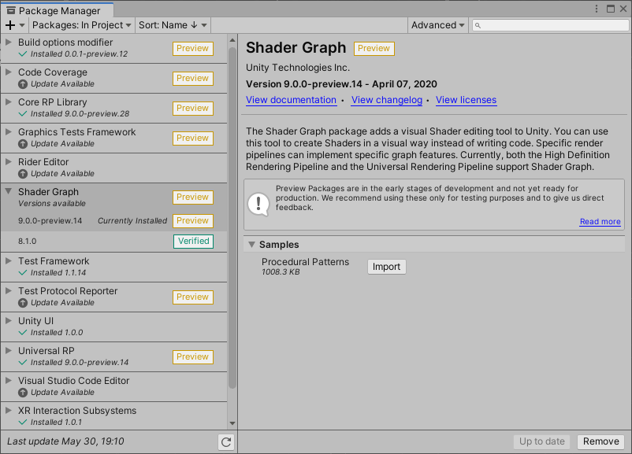
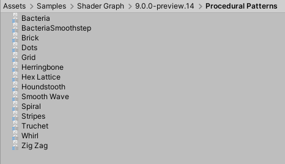
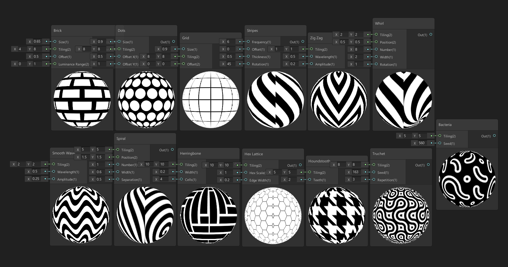
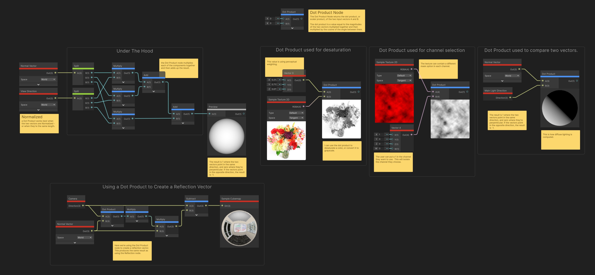
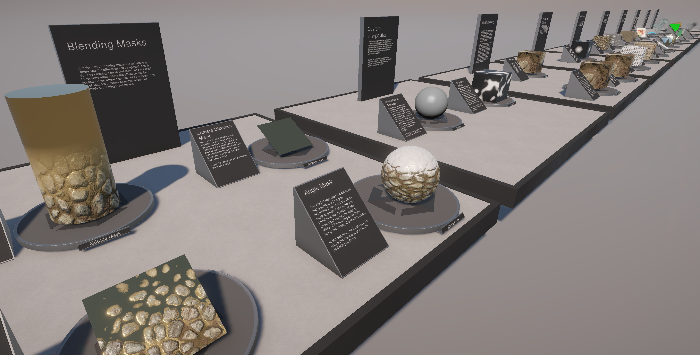

# Shader Graph samples

## Description

The Shader Graph package offers sample Assets, which you can download through **Package Manager**. When you import these samples, Unity places the files in your Project's Asset folder. The files contain examples that demonstrate how to use Shader Graph features.

## Add samples

To add samples to your Project, go to **Window** > **Package Manager**. Locate **Shader Graph** in the list of available packages, and select it. Under the package description, there is list of available samples. Click the **Import into Project** button next to the sample you wish to add.

Unity places imported samples in your Project's Asset folder under **Assets** > **Samples** > **Shader Graph** > **[version number]** > **[sample name]**. The example below shows the samples for **Procedural Patterns**.

## Available samples

The following samples are currently available for Shader Graph.

| Procedural Patterns |
|:--------------------|
| |
| This collection of Assets showcases various procedural techniques possible with Shader Graph. Use them directly in your Project, or edit them to create other procedural patterns. The patterns in this collection are: Bacteria, Brick, Dots, Grid, Herringbone, Hex Lattice, Houndstooth, Smooth Wave, Spiral, Stripes, Truchet, Whirl, Zig Zag. |

| Node Reference |
|:--------------------|
| |
| This set of Shader Graph assets provides reference material for the nodes available in the Shader Graph node library. Each graph contains a description for a specific node, examples of how it can be used, and useful tips. Some example assets also show a break-down of the math that the node is doing. You can use these samples along with the documentation to learn more about the behavior of individual nodes. |

| [Feature Examples](Shader-Graph-Sample-Feature-Examples.md) |
|:--------------------|
| |
| This is a collection of over 30 Shader Graph files.  Each file demonstrates a specific shader technique such as angle blending, triplanar projection, parallax mapping, and custom lighting. While you won’t use these shaders directly in your project, you can use them to quickly learn and understand the various techniques, and recreate them into your own work. Each file contains notes that describe what the shader is doing, and most of the shaders are set up with the core functionality contained in a subgraph that’s easy to copy and paste directly into your own shader. The sample also has extensive documentation describing each of the samples to help you learn.
 |
